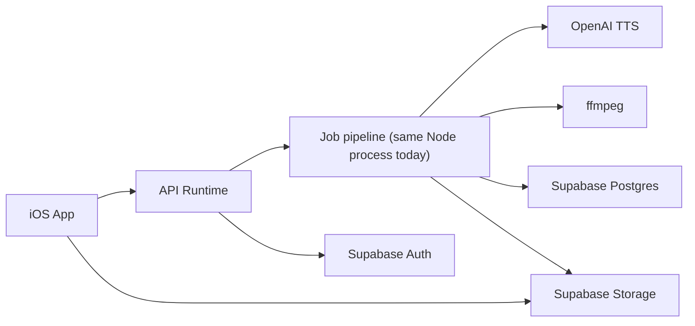

# Hear It

**Turn any article into a podcast — instantly.**

Hear It is an iOS app that converts long-form web articles into natural-sounding audio. Paste a link, pick a voice, and listen while you commute, cook, or work out.

## Features

- **One-tap conversion** — paste any article URL and get a spoken version in seconds
- **Natural voices** — powered by OpenAI's text-to-speech with multiple voice options
- **Background playback** — keep listening while you use other apps
- **Article library** — revisit past audio from your personal library
- **Smart extraction** — strips ads, nav bars, and page chrome so the spoken audio stays focused on the article

## How It Works

1. Paste an article URL (or share from your browser)
2. Choose a voice
3. Hear It extracts the article and generates spoken audio
4. Listen from the built-in player with full background audio support

## Architecture

| Component | Stack |
|-----------|-------|
| iOS app | SwiftUI, AVFoundation |
| API runtime | Express, TypeScript |
| Auth | Supabase Auth |
| TTS | OpenAI `gpt-4o-mini-tts` |
| Database | Supabase (Postgres) |
| Hosting | Render (Docker) |
| Analytics | PostHog |
| Error tracking | Sentry |



Today the HTTP API and background job pipeline run in the same Node service. The code keeps those responsibilities separated so they can move into distinct API and worker services later without changing the client contract.

## Repository Layout

```
apps/
  ios/          SwiftUI iPhone app
  api/          Express API server (extraction, TTS, job management)
docs/           Product and technical design notes
scripts/        Dev tooling
```

## Getting Started

### Prerequisites

- Node.js 20+
- Yarn
- Xcode 26+ (for iOS development)
- [XcodeGen](https://github.com/yonaskolb/XcodeGen)

### API Server

```bash
yarn install
yarn dev
```

The API starts on `http://localhost:3000`.

`yarn dev` runs the local file-backed development server from `apps/api/src/server.ts`. That path is meant for fast iteration and can work in a few different auth modes:

- no auth env configured: pass-through auth for local UI iteration
- `SUPABASE_JWT_SECRET` only: shared-secret verification with Supabase JWKS fallback against the default project
- explicit `SUPABASE_URL`: JWKS verification against that project

Useful local env:

```env
OPENAI_API_KEY=sk-...          # Required for real TTS (omit for fake provider)
SUPABASE_URL=...               # Optional explicit Supabase project URL for auth verification
SUPABASE_JWT_SECRET=...        # Optional shared-secret fallback for local auth verification
```

For a production-like local run, build and start `apps/api/src/production.ts` instead. That path requires real storage and database env such as:

```env
POSTGRES_URL=...
SUPABASE_URL=...
SUPABASE_SERVICE_ROLE_KEY=...
SUPABASE_STORAGE_BUCKET=audio  # Optional; defaults to "audio"
```

Run it with:

```bash
yarn --cwd apps/api build
yarn --cwd apps/api start:production
```

Optional variables:

| Variable | Default | Description |
|----------|---------|-------------|
| `OPENAI_TTS_MODEL` | `gpt-4o-mini-tts` | TTS model |
| `TTS_CONCURRENCY` | `5` | Parallel TTS jobs |
| `AUDIO_PUBLIC_BASE_URL` | `/audio` | Audio URL prefix |
| `AUDIO_OUTPUT_DIR` | `data/audio` | Local audio storage (dev) |

### iOS App

```bash
cd apps/ios
cp local.xcconfig.example local.xcconfig
# Edit local.xcconfig → set DEVELOPMENT_TEAM to your Apple Team ID
xcodegen generate
open HearIt.xcodeproj
```

Build and run on Simulator (uses `http://127.0.0.1:3000`) or a physical device (configure the API URL in the in-app Settings screen).

### Debug Launch Overrides

These are available in Debug builds and are useful for local iteration and automation:

| Variable | Description |
|----------|-------------|
| `HEAR_IT_DEBUG_API_BASE_URL` | Temporarily overrides the app's API base URL for that debug launch without mutating persisted defaults |
| `HEAR_IT_DEBUG_AUTOCREATE_URL` | Auto-fills and submits a URL once the app boots |
| `HEAR_IT_DEBUG_AUTOMATION=seek-and-reopen` | Runs the seek-and-reopen playback automation used during player debugging |

If you want the share extension to use a local backend too, save that URL through the in-app Settings screen so it propagates through the shared app-group defaults.

The repo also includes `.xcodebuildmcp/config.yaml` with simulator, device, and UI automation workflows enabled for local iOS debugging.

## Privacy

Hear It collects minimal data. See the full [Privacy Policy](/privacy) served by the API.

- No cross-app tracking
- No data sold to third parties
- Anonymous analytics only (PostHog)
- Crash reporting via Sentry (no personal content)

## License

Private — all rights reserved.
