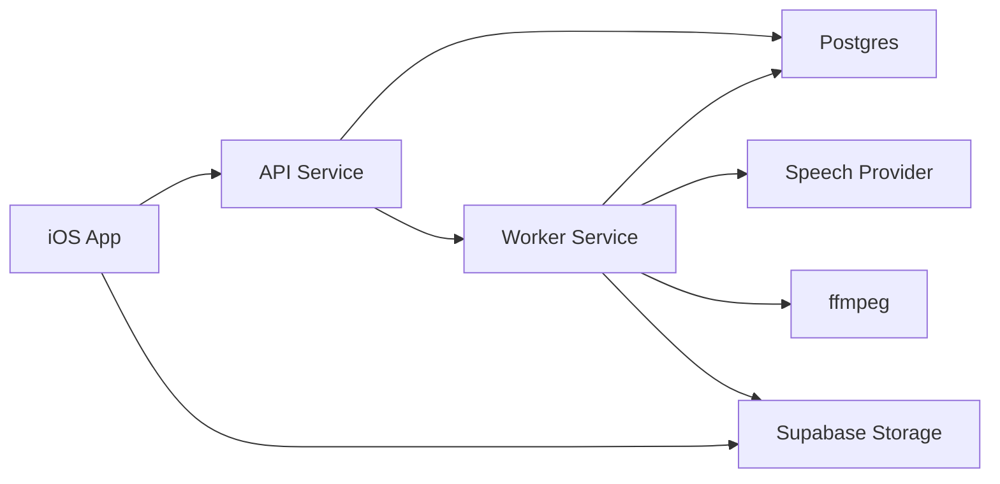

# Hear It System Overview

Hear It turns long-form web articles into spoken audio that can start playing before generation finishes and continue smoothly after the final asset is ready.

This document is the entry point for the current architecture. It stays intentionally high level and links to the focused docs for the details.

## Design Goals

- start playback quickly without mid-listen starvation
- keep completed playback simple, stable, and offline-friendly
- preserve flexibility to switch speech providers later
- keep product-facing concepts simpler than backend internals
- stay cheap enough for day 1 while leaving a clean path to grow

## Document Map

- [Ubiquitous Language](/Users/tome/projects/hear-it/docs/ubiquitous-language.md)
- [Audio Pipeline Architecture](/Users/tome/projects/hear-it/docs/audio-pipeline-architecture.md)
- [Streaming Playback Contract](/Users/tome/projects/hear-it/docs/streaming-playback-contract.md)
- [Design Spec: 2026-04-04 Audio Pipeline Redesign](/Users/tome/projects/hear-it/docs/superpowers/specs/2026-04-04-audio-pipeline-redesign-design.md)

## System At A Glance

## Core Runtime Pieces

### iOS App

- submits and polls audio jobs
- streams in-progress audio over HLS
- plays completed audio from the canonical final MP3
- keeps a local file copy as a silent optimization only

### API Service

- accepts job creation requests
- returns job status plus playback descriptors
- exposes a product-facing contract that hides backend plumbing

### Worker Service

- normalizes extracted text into a speech script
- chunks text semantically
- synthesizes speech with bounded parallelism
- packages in-progress HLS and the final MP3
- owns retries, recovery, and maintenance loops in v1

### Postgres

- canonical job state
- job events timeline
- worker leases, retries, and coordination state

### Supabase Storage

- temporary HLS playlists and segments
- canonical completed MP3
- simple public URL delivery for day 1

## Product Rules That Shape The Architecture

- processing playback uses real HLS
- completed playback uses a canonical final MP3
- active playback sessions never switch from HLS to MP3 mid-session
- HLS stays available for 6 hours after completion
- playback only becomes available after a real startup buffer exists
- local device storage is not a user-facing state

## Day 1 Infrastructure

- Render Hobby workspace
- one Starter web service for the API
- one Starter background worker for speech generation and packaging
- Supabase Free for Postgres and Storage
- OpenAI as the primary speech provider behind a provider abstraction

## Deferred Decisions

- whether to add a user-facing offline/download feature
- whether to move maintenance from the worker interval to Render Cron
- when to add a second speech provider or local TTS adapter
- when to move from Supabase Free to a paid plan
