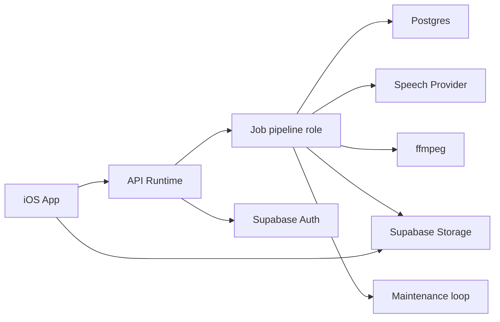

# Hear It System Overview

Hear It turns long-form web articles into spoken audio. The current system is intentionally batch-only: the app polls job state while audio is generated, and playback begins once the final MP3 is ready.

This document is the entry point for the current architecture. It stays intentionally high level and links to the focused docs for the details.

## Design Goals

- keep playback simple, stable, and friendly to repeat on-device listening
- give users clear processing progress without exposing backend plumbing
- preserve flexibility to switch speech providers later
- keep product-facing concepts simpler than backend internals
- stay cheap enough for day 1 while leaving a clean path to grow

## Document Map

- [Ubiquitous Language](./ubiquitous-language.md)
- [Audio Pipeline Architecture](./audio-pipeline-architecture.md)
- [Playback Contract](./streaming-playback-contract.md)
- [Design Spec: 2026-04-04 Audio Pipeline Redesign](./superpowers/specs/2026-04-04-audio-pipeline-redesign-design.md)

## System At A Glance

## Core Runtime Pieces

### iOS App

- submits and polls audio jobs
- plays completed audio from the canonical final MP3
- keeps a local file copy as a silent optimization only

### API Runtime

- accepts job creation requests
- returns job status plus playback descriptors
- exposes a product-facing contract that hides backend plumbing
- currently kicks off job processing in-process after job creation
- currently runs maintenance in the same Node runtime on the production entrypoint

### Job Pipeline Role

- normalizes extracted text into a speech script
- chunks text semantically
- synthesizes speech with bounded parallelism
- packages the completed final MP3
- owns retries, recovery, and maintenance loops in v1

Today this role runs in the same Node service as the HTTP API. The code keeps the responsibilities separated so they can move into a dedicated worker deployment later.

### Postgres

- canonical job state
- job events timeline
- worker leases, retries, and coordination state

### Supabase Storage

- temporary chunk MP3s during processing
- canonical completed MP3
- simple public URL delivery for day 1

## Product Rules That Shape The Architecture

- processing jobs are not yet playable
- completed jobs expose one canonical final MP3 playback source
- progress metadata may advance before playback is available
- local device storage is an implementation detail, not a user-facing state

## Day 1 Infrastructure

- Render Hobby workspace
- one Starter web service for the API
- one Starter background worker for speech generation and packaging once we split deployment
- Supabase Free for Postgres and Storage
- OpenAI as the primary speech provider behind a provider abstraction

## Deferred Decisions

- whether to add a user-facing offline/download feature
- whether to move maintenance from the worker interval to Render Cron
- when to add a second speech provider or local TTS adapter
- when to move from Supabase Free to a paid plan
- whether to reintroduce in-progress streaming later, using the learnings captured in [Streaming Learnings](./streaming-learnings.md)
