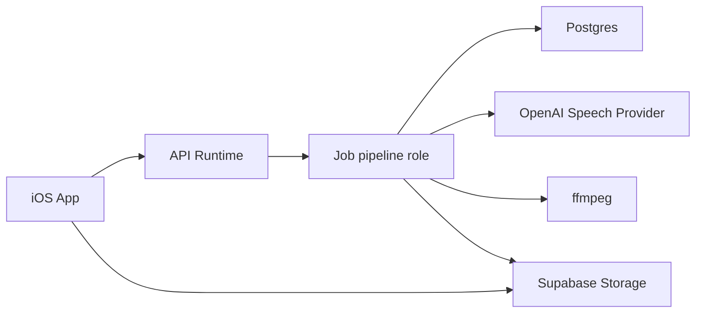
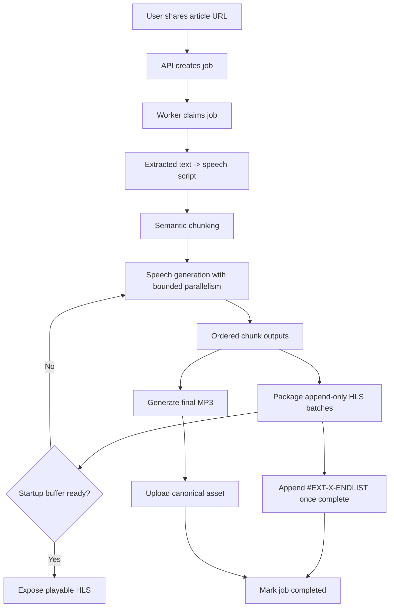
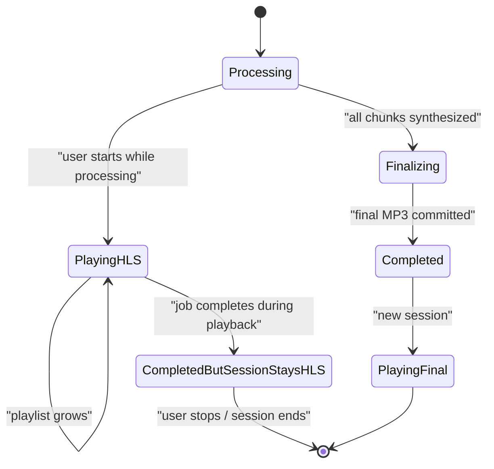
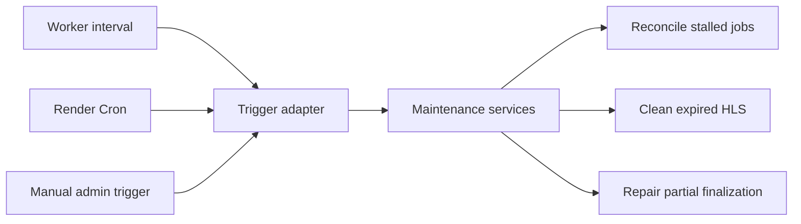

# Hear It Audio Pipeline Architecture

This document describes the current backend pipeline design for turning an extracted article into smooth in-progress playback and a stable completed asset.

## Goals

- start playback in 10-20 seconds when possible
- avoid mid-listen buffering once playback begins
- keep completed playback boring and reliable
- preserve provider flexibility
- stay cheap enough for day 1

## Non-Goals

- ultra-low-latency live streaming
- adaptive bitrate ladders
- DRM
- user-facing download management in v1

## Core Decisions

- use OpenAI as the day 1 speech provider behind a strong abstraction
- normalize article text into a deterministic speech script before synthesis
- synthesize semantic chunks with bounded parallelism
- package in-progress playback as AAC/fMP4 HLS
- package completed playback as a canonical MP3
- keep temporary HLS for 6 hours after completion
- treat local device storage as a silent optimization only

## System Context

Today the HTTP API and the job pipeline run in the same Node process. This document still uses `job pipeline role` language because the code is intentionally structured so that role can move into a dedicated worker service later without changing playback behavior.

## End-To-End Flow

## Content Preparation

### Input

- extracted title
- extracted article text
- optional metadata such as byline, captions, and site name

### Output

- original extracted text preserved
- derived speech script preserved

### Speech Script Rules

- never paraphrase or summarize
- keep headings, but cue them lightly
- include meaningful image captions
- remove or humanize noisy web artifacts
- protect hostile spoken tokens such as raw URLs or code-like text

## Chunking And Batching

### Chunking

Chunking is the unit of text sent to the speech provider.

Rules:

- chunk semantically, not by raw character count
- respect sentence and paragraph boundaries
- target roughly 15-25 seconds of speech per chunk
- preserve final ordering strictly

### Batching

Batching is the unit of HLS publication.

Rules:

- first playable publish waits for a startup buffer
- later HLS extensions publish short ordered batches
- packaging should not thrash on every single completed chunk
- published HLS history is immutable once exposed

## Append-Only HLS Publishing

The worker publishes a growing HLS EVENT playlist, but it must not rewrite stream history.

Rules:

- once a segment is published, its key and bytes never change
- new packaging work only uploads new init/segment objects for the next batch
- the playlist URL stays stable, but the playlist text only grows
- later batches are appended with discontinuities rather than rebuilding the whole stream from zero
- finalization appends `#EXT-X-ENDLIST`; it does not replace old segments with a new stream snapshot
- the worker tracks how many chunks have already been published so a restart resumes from the last append point rather than rebuilding prior batches

This preserves the contract for active HLS sessions and prevents the player from effectively running on an old view of a constantly rewritten stream.

## Startup Buffer Policy

Playback does not become available the moment the first chunk finishes.

Policy:

- package until about 20-30 seconds of real playable audio exists
- only then expose the HLS stream as playable
- once playback starts, aim to stay roughly 30-45 seconds ahead of the listener

This trades a small amount of initial wait for much smoother listening.

## Media Formats

### Worker Intermediate

The worker may use PCM or WAV as a short-lived intermediate representation when that improves packaging correctness and timing predictability.

This is not a user-facing persisted format.

### In-Progress Playback

- codec family: AAC
- container/segment strategy: fMP4/CMAF HLS
- playlist type: EVENT while processing
- publication strategy: append-only batches with immutable published segments

### Completed Playback

- canonical completed asset: MP3
- stored in Supabase Storage
- used for all new sessions after completion

## Playback Handoff Rules

Rules:

- never switch an active HLS session to the final MP3 mid-session
- keep the session pinned to the asset it started with
- once the job is complete, expose the final MP3 for all new sessions
- keep the completed HLS playlist available long enough for already active sessions to finish cleanly
- the active HLS session may continue using its own timeline semantics even after the backend exposes the final MP3 for new sessions

## Storage Model

### Postgres

Postgres stores:

- job rows
- public state
- internal pipeline state
- playback descriptor source fields
- progress metadata
- job events
- leases and retry coordination

### Supabase Storage

Supabase Storage stores:

- HLS playlists
- HLS segments
- canonical final MP3

Completed jobs may temporarily have both:

- a retained HLS stream for active pinned sessions
- a canonical final MP3 for new sessions and local caching

### Object Keys

- keep internal object keys opaque and stable
- derive user-facing filenames from the article title or a safe fallback

## Retention And Deletion

### HLS

- temporary
- retained for 6 hours after completion
- deleted by maintenance cleanup

### Final MP3

- durable until explicit deletion

### Job Deletion

Deleting a job deletes:

- final MP3
- any remaining HLS artifacts

Internal job events remain internal-only and should avoid storing raw article text in their payloads.

## Concurrency Model

- 2-4 chunk syntheses in flight per job
- strict output order regardless of completion order
- global worker caps to avoid starvation
- prioritize startup-buffer work first

## Retry And Recovery

### Retry Policy

- 3 automatic attempts per failed chunk or step
- exponential backoff
- preserve already completed chunks
- fail the job only after retry budget exhaustion

### Recovery Model

- jobs are claimed with a lease
- workers heartbeat active work
- a reconciler can re-queue resumable jobs after lease expiry

## Maintenance Responsibilities

The maintenance logic is part of the domain design, not tied to one trigger mechanism.

Domain services:

- `JobReconciler`
- `HlsRetentionCleaner`
- `FinalizationRepairer`

Day 1 trigger:

- worker-owned interval

Future trigger options:

- Render Cron Job
- manual internal admin trigger

## Internal Observability

### Durable Job Event Log

Store milestone events in a lightweight internal table.

Event examples:

- `job_created`
- `normalization_completed`
- `chunk_ready`
- `startup_buffer_ready`
- `playlist_published`
- `final_asset_uploaded`
- `retry_scheduled`
- `job_completed`
- `job_failed`

### Structured Logs

Use structured logs for:

- ffmpeg stderr
- provider failures
- storage failures
- detailed retry diagnostics

### Correlation

Capture:

- `job_id`
- `run_id`
- `attempt`
- `worker_id`
- provider request IDs when available
