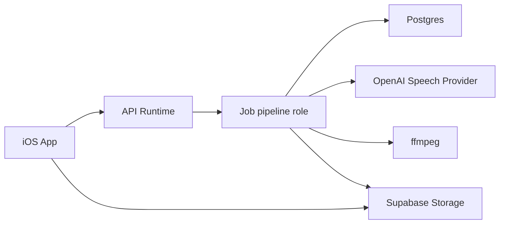
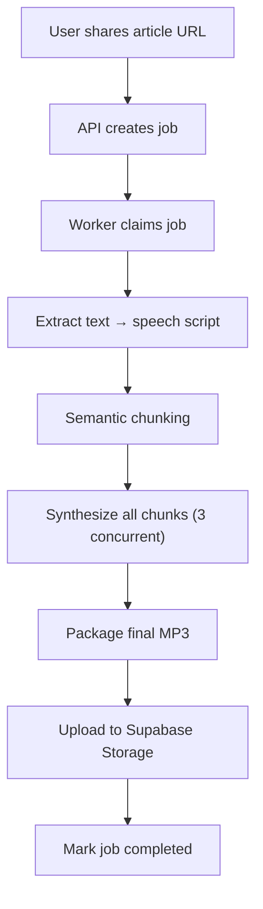
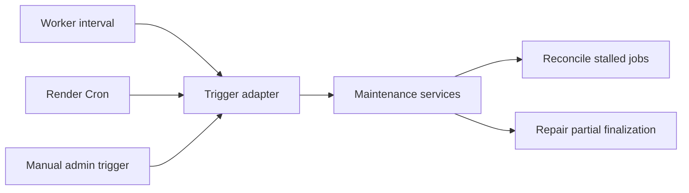

# Hear It Audio Pipeline Architecture

This document describes the current backend pipeline design for turning an extracted article into a completed audio asset.

## Goals

- generate audio within 30-60 seconds
- keep completed playback boring and reliable
- preserve provider flexibility
- stay cheap enough for day 1

## Non-Goals

- ultra-low-latency live streaming
- adaptive bitrate ladders
- DRM
- user-facing download management in v1

## Core Decisions

- use OpenAI as the day 1 speech provider behind a strong abstraction
- normalize article text into a deterministic speech script before synthesis
- synthesize semantic chunks with bounded parallelism
- package completed audio as a single MP3 (no streaming)
- treat local device storage as a silent optimization only

Note: HLS streaming was explored and removed. See `docs/streaming-learnings.md`.

## System Context

Today the HTTP API and the job pipeline run in the same Node process. This document still uses `job pipeline role` language because the code is intentionally structured so that role can move into a dedicated worker service later without changing playback behavior.

ffmpeg is used for MP3 concatenation of synthesized chunks into the final asset.

## End-To-End Flow

## Content Preparation

### Input

- extracted title
- extracted article text
- optional metadata such as byline, captions, and site name

### Output

- original extracted text preserved
- derived speech script preserved

### Speech Script Rules

- never paraphrase or summarize
- keep headings, but cue them lightly
- include meaningful image captions
- remove or humanize noisy web artifacts
- protect hostile spoken tokens such as raw URLs or code-like text

## Chunking

Chunking is the unit of text sent to the speech provider.

Rules:

- chunk semantically, not by raw character count
- respect sentence and paragraph boundaries
- target roughly 15-25 seconds of speech per chunk
- preserve final ordering strictly

## Media Formats

### Worker Intermediate

The worker may use PCM or WAV as a short-lived intermediate representation when that improves packaging correctness and timing predictability.

This is not a user-facing persisted format.

### Completed Playback

- canonical completed asset: MP3
- stored in Supabase Storage
- used for all playback sessions

## Storage Model

### Postgres

Postgres stores:

- job rows
- public state
- internal pipeline state
- playback descriptor source fields
- progress metadata
- job events
- leases and retry coordination

### Supabase Storage

Supabase Storage stores:

- final MP3 (durable)
- temporary chunk MP3s (during processing only)

### Object Keys

- keep internal object keys opaque and stable
- derive user-facing filenames from the article title or a safe fallback

## Retention And Deletion

### Final MP3

- durable until explicit deletion

### Temporary Chunks

- cleaned up by maintenance after job completion

### Job Deletion

Deleting a job deletes:

- final MP3
- any remaining temporary chunk files

Internal job events remain internal-only and should avoid storing raw article text in their payloads.

## Concurrency Model

- 3 chunk syntheses in flight per job
- strict output order regardless of completion order
- global worker caps to avoid starvation

## Retry And Recovery

### Retry Policy

- 3 automatic attempts per failed chunk or step
- exponential backoff
- preserve already completed chunks
- fail the job only after retry budget exhaustion

### Recovery Model

- jobs are claimed with a lease
- workers heartbeat active work
- a reconciler can re-queue resumable jobs after lease expiry

## Maintenance Responsibilities

The maintenance logic is part of the domain design, not tied to one trigger mechanism.

Domain services:

- `JobReconciler`
- `FinalizationRepairer`

Day 1 trigger:

- worker-owned interval

Future trigger options:

- Render Cron Job
- manual internal admin trigger

## Internal Observability

### Durable Job Event Log

Store milestone events in a lightweight internal table.

Event examples:

- `job_created`
- `normalization_completed`
- `chunk_ready`
- `final_asset_uploaded`
- `retry_scheduled`
- `job_completed`
- `job_failed`

Note: streaming-era events (`startup_buffer_ready`, `playlist_published`) have been removed. See `docs/streaming-learnings.md`.

### Structured Logs

Use structured logs for:

- ffmpeg stderr
- provider failures
- storage failures
- detailed retry diagnostics

### Correlation

Capture:

- `job_id`
- `run_id`
- `attempt`
- `worker_id`
- provider request IDs when available
