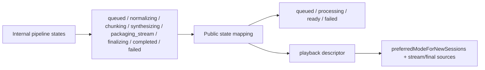

# Hear It Streaming Playback Contract

This document defines the public-facing API and client behavior for job status and playback.

The goal is to make playback behavior explicit so the client never has to infer semantics from the presence or absence of low-level fields.

## Design Principles

- the client should reason about playback through one canonical descriptor
- public job states stay coarse and stable
- backend internals stay richer than product states
- playback availability is explicit

## Public Job States

- `queued`
- `processing`
- `ready`
- `failed`

These states are product-facing. The backend may use richer internal states, but the client should not depend on them.

## Playback Descriptor

The API exposes one canonical playback object, but it no longer forces the client into an exclusive `streaming | final` choice.

That change matters because a completed job can legitimately have:

- a still-valid HLS stream for an already active pinned session
- a final MP3 for all new playback sessions

```ts
type PlaybackDescriptor = {
  preferredModeForNewSessions: "none" | "stream" | "final";
  isPlayable: boolean;
  stream: {
    playlistUrl: string;
    availableDurationSeconds: number;
    liveEdgeUpdatedAt: string;
    isComplete: boolean;
  } | null;
  final: {
    audioUrl: string;
    durationSeconds: number;
    fileName: string;
  } | null;
  errorMessage: string | null;
};
```

Interpretation:

- `preferredModeForNewSessions` tells the client what a fresh session should load
- `stream` describes the append-only HLS source, when present
- `final` describes the canonical completed MP3, when present
- `errorMessage` is only meaningful when playback is not playable because the job failed
- the descriptor answers what sources exist for the job, but it does not override the source an already active player session is pinned to

## Audio Job Response

```ts
type AudioJobResponse = {
  id: string;
  title: string;
  state: "queued" | "processing" | "ready" | "failed";
  playback: PlaybackDescriptor;
  progress: {
    chunksTotal: number | null;
    chunksReady: number;
    availableDurationSeconds: number;
  };
  createdAt: string;
  updatedAt: string;
};
```

## Client Rules

### While Preparing

If `playback.isPlayable === false` and `playback.errorMessage == null`:

- the play button should not start playback
- UI may say `Preparing audio`
- the user should not be promised that playback is ready yet

### For New Streaming Sessions

If `playback.preferredModeForNewSessions === "stream"` and `playback.stream` exists:

- start a new AVPlayer item from `playback.stream.playlistUrl`
- treat `playback.stream.availableDurationSeconds` as the current playable range
- do not allow seeking beyond the available duration
- if the user tries, show soft copy such as `That part is still being generated`

### For New Final Sessions

If `playback.preferredModeForNewSessions === "final"` and `playback.final` exists:

- start a new AVPlayer item from `playback.final.audioUrl`
- full seeking is now supported
- the user-facing filename should come from `playback.final.fileName`

### For Active Pinned HLS Sessions

If the current AVPlayer item already started from `playback.stream.playlistUrl`:

- keep the current session on HLS even if `preferredModeForNewSessions` later flips to `final`
- keep HLS-specific control restrictions for that active session
- treat `playback.final` as a source for future sessions, not as a command to mutate the current one
- use `stream.isComplete` only to understand that the stream will stop growing, not to switch the active player item

### While Failed

If `playback.isPlayable === false` and `playback.errorMessage` exists:

- do not try to start playback
- show the user-facing failure state

## Session Pinning

Once playback starts, the session stays on the asset it started with.

Rules:

- if a session started on HLS, keep it on HLS until stop, unload, or natural end
- if the job completes during playback, do not switch the current player item
- use the final MP3 only for future playback sessions
- a completed job may therefore expose both `stream` and `final` at the same time
- the UI may reveal the exact final duration once completion is known, but that does not imply a source switch for the active session
- the client must reason separately about `preferredModeForNewSessions` and the current player item's actual source

## Polling Contract

The app should use:

- HTTP polling for job state
- HLS or MP3 for audio delivery

Suggested polling behavior:

- visible processing job: every 2-3 seconds
- actively streaming and live edge moving: every 2-3 seconds
- background or non-visible state: back off hard or stop polling

## UX Semantics

### User-Facing Concepts

The app should communicate:

- `Preparing audio`
- `Generating audio`
- `Ready`
- `Failed`

The app should not communicate:

- cache status
- packaging internals
- provider identity
- backend step names such as `synthesizing`

### Seeking Before Completion

Seeking past the live edge should be treated as a normal product case, not an error.

Recommended soft copy:

- `That part is still being generated`
- `More audio is on the way`

## State Mapping



## Future Compatibility

This contract is designed to survive:

- speech provider swaps
- storage backend changes
- introduction of local TTS
- migration of maintenance triggers

As long as the API still produces the same playback descriptor semantics, the client should not need to care about those backend changes.
