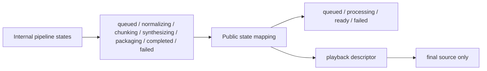

# Hear It Playback Contract

This document defines the current public-facing API and client behavior for job status and playback.

Note: the filename is kept for link stability, but the contract below reflects the current batch-only design.

## Design Principles

- the client should reason about playback through one explicit descriptor
- public job states stay coarse and stable
- playback availability should never be inferred from legacy fields
- progress metadata may advance before playback is available

## Public Job States

- `queued`
- `processing`
- `ready`
- `failed`

These states are product-facing. The backend may use richer internal states, but the client should not depend on them.

## Playback Descriptor

```ts
type PlaybackDescriptor = {
  isPlayable: boolean;
  final: {
    audioUrl: string;
    durationSeconds: number;
    fileName: string;
  } | null;
  errorMessage: string | null;
};
```

Interpretation:

- `isPlayable` tells the client whether playback can start right now
- `final` describes the canonical completed MP3 source, when present
- `errorMessage` is only meaningful when playback is not playable because the job failed

## Audio Job Response

```ts
type AudioJobResponse = {
  id: string;
  title: string;
  state: "queued" | "processing" | "ready" | "failed";
  playback: PlaybackDescriptor;
  progress: {
    chunksTotal: number | null;
    chunksReady: number;
    availableDurationSeconds: number;
  };
  createdAt: string;
  updatedAt: string;
};
```

Progress interpretation:

- `chunksReady` is the number of synthesized chunks currently persisted
- `chunksTotal` is known once the speech script has been prepared and chunked; it may be `null` while a job is still queued
- `availableDurationSeconds` is progress metadata only; it does not mean playback is ready

## Client Rules

### While Queued Or Processing

If `playback.isPlayable === false` and `playback.errorMessage == null`:

- the play button should not start playback
- UI may say `Preparing audio` or `Generating audio`
- progress copy may use `chunksReady`, `chunksTotal`, or `availableDurationSeconds`
- the user should not be promised that playback is ready yet

### For Ready Playback

If `playback.isPlayable === true` and `playback.final` exists:

- start a new AVPlayer item from `playback.final.audioUrl`
- full seeking is supported
- the user-facing filename should come from `playback.final.fileName`

### While Failed

If `playback.isPlayable === false` and `playback.errorMessage` exists:

- do not try to start playback
- show the user-facing failure state

## Polling Contract

The app should use:

- HTTP polling for job state
- MP3 for completed audio delivery

Suggested polling behavior:

- visible queued or processing job: every 3-5 seconds
- ready or failed job: back off hard or stop polling

## UX Semantics

### User-Facing Concepts

The app should communicate:

- `Preparing audio`
- `Generating audio`
- `Ready`
- `Failed`

The app should not communicate:

- cache status
- packaging internals
- provider identity
- backend step names such as `synthesizing`

## State Mapping



## Future Compatibility

This contract is designed to survive:

- speech provider swaps
- storage backend changes
- introduction of local TTS
- migration of maintenance triggers

If streaming is reintroduced later, it should happen as an explicit contract change rather than through inference from legacy fields.
